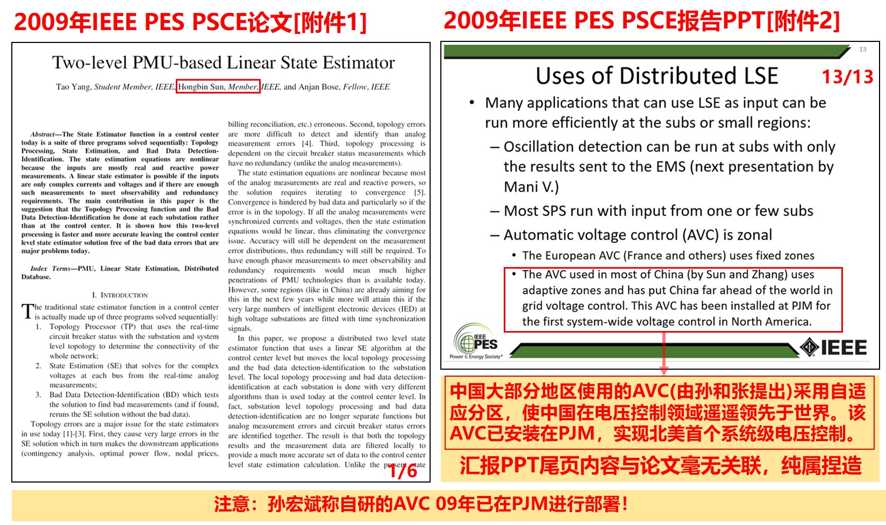
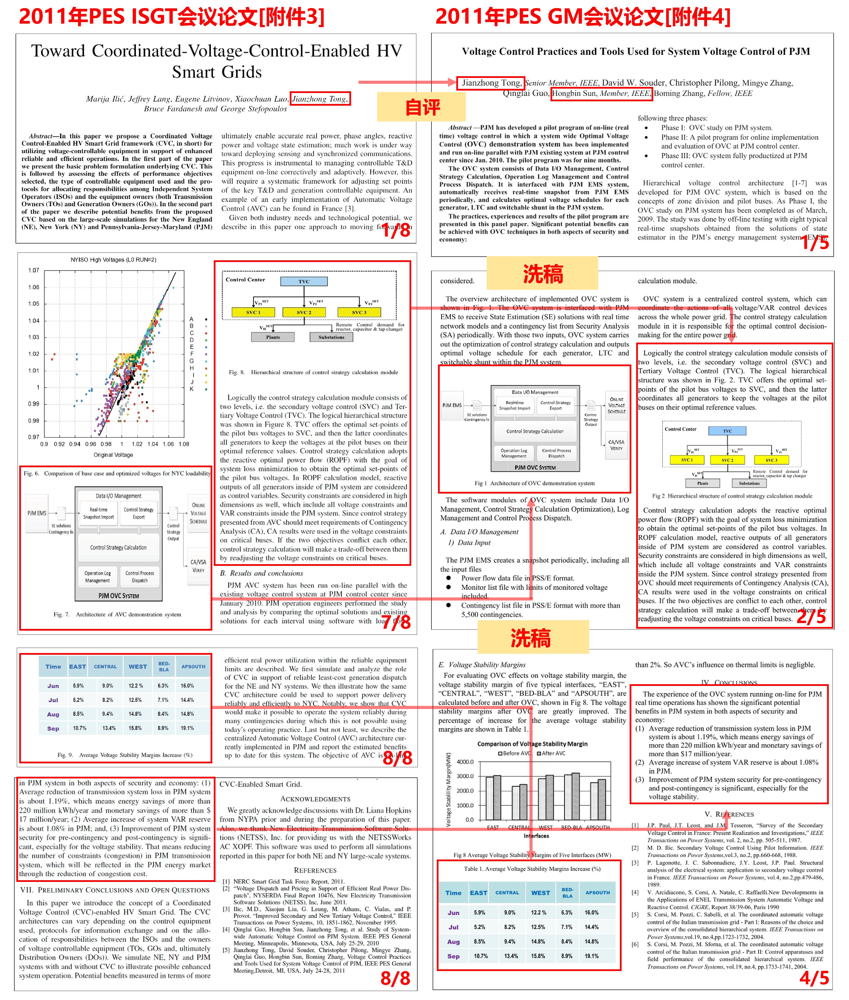
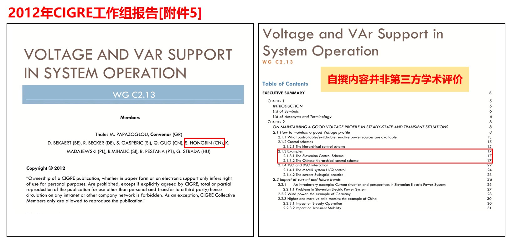
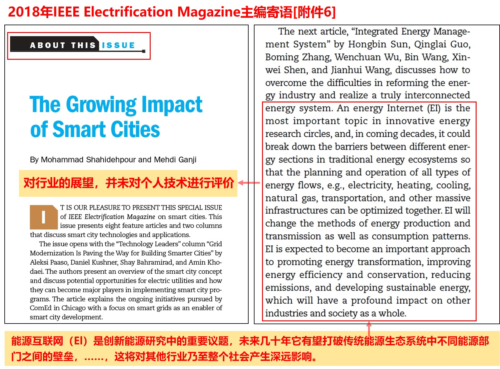
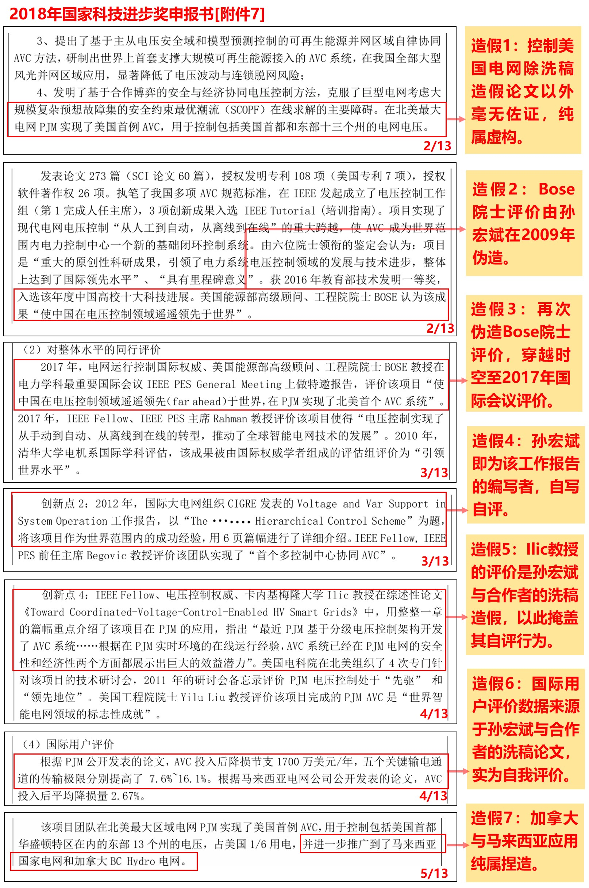
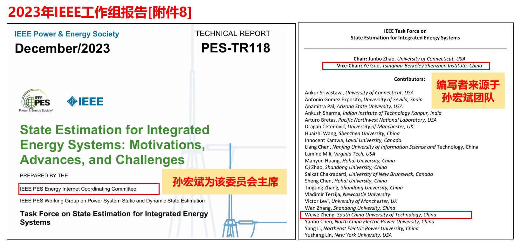
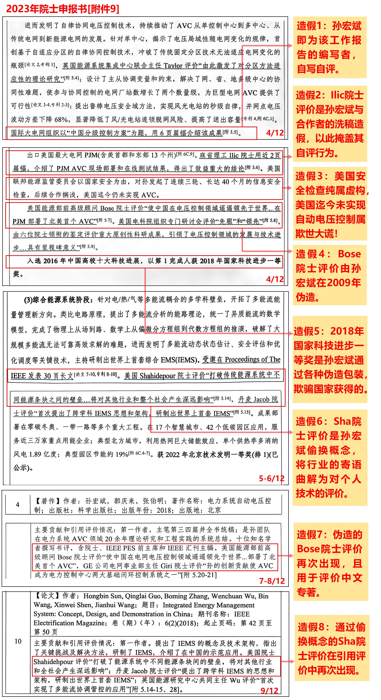
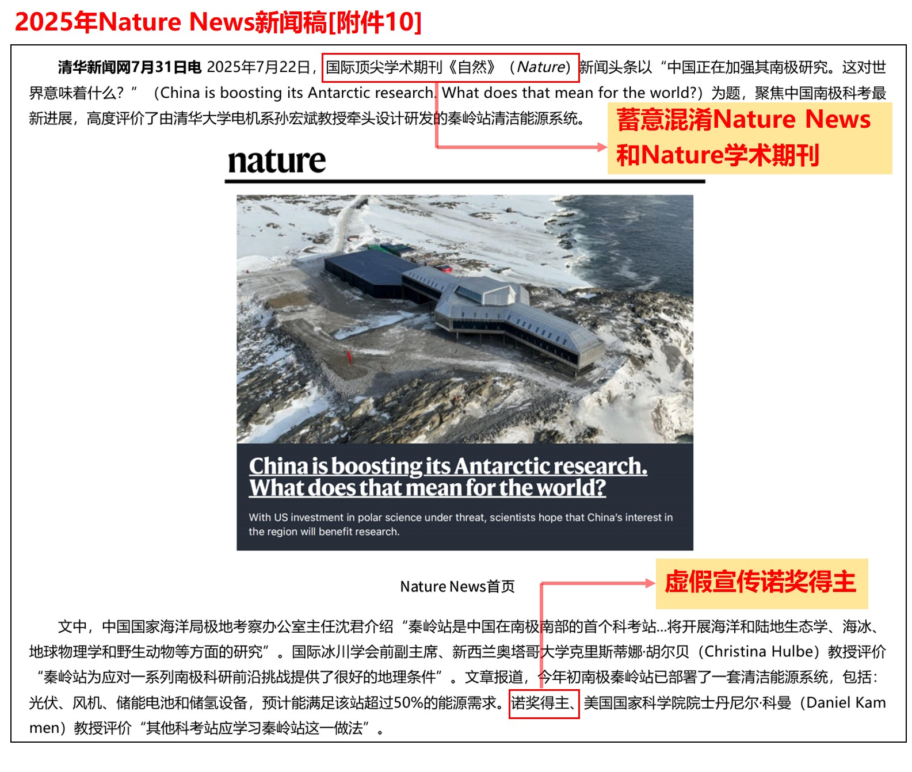
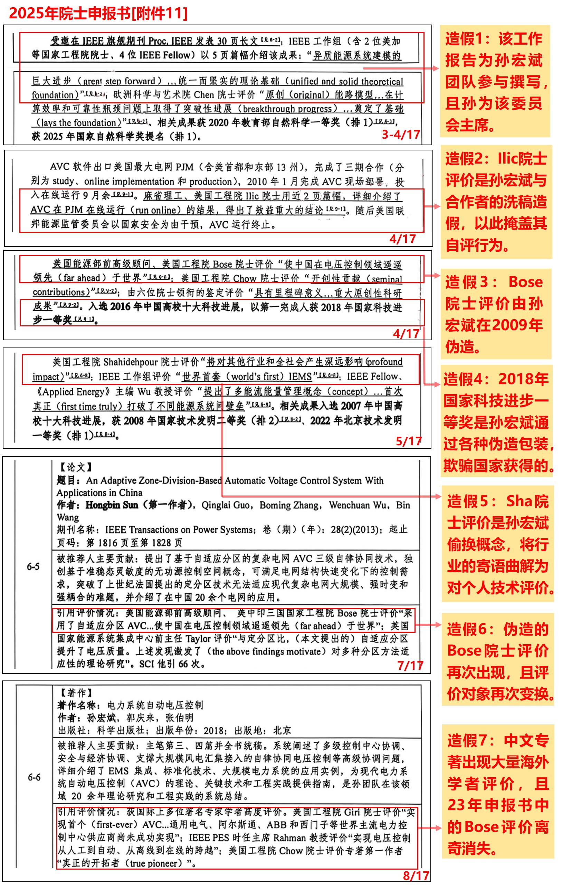

# 自作不息 厚黑载物—太原理工校长孙宏斌院士奋斗史

​&emsp;&emsp;清华校训“自强不息，厚德载物”，激励无数青年以天下为己任，以奋斗为底色。当出身清华的孙宏斌执掌太原理工大学帅印时，全校上下曾寄望其能将清华风骨注入这所百年学府。然而，凡有真金，必有镀金；凡有大道，必有歧路。
 &emsp;&emsp;孙宏斌出身清华，深知若要真正践行清华校训这条路，必然走得慢，走得苦。于是孙宏斌选择另辟蹊径，走上了一条“自作不息、厚黑载物”的旁门左道，一路走来，直至攫取太原理工大学校长、中科院院士高位，以下列举孙宏斌近20年来九大厚黑之作。

#### 一作 狗尾续貂：伪造美国工程院院士Anjan Bose教授评价

​&emsp;&emsp;孙宏斌在2017年申报国家奖、2023年及2025年申报院士材料中，多次提供美国工程院院士Anjan Bose教授对其自动电压控制(Automatic Voltage Control, AVC)技术的正面评价：【使中国在电压控制领域遥遥领先于世界，在PJM实现了北美首个AVC系统】。经查证，该“正面评价”系孙宏斌通过不正当手段刻意编造。2009年，孙宏斌、其学生Tao Yang与Anjan Bose在IEEE电力与能源协会国际学术会议(PSCE)上合作发表论文《Two-level PMU-based Linear State Estimator》，全文聚焦于线性状态估计技术研究，与自动电压控制技术毫无关联。孙宏斌利用Bose教授作为代表出席演讲的机会，授意在报告PPT尾页植入对其AVC工作所谓的“正面评价”。孙宏斌借此机会，凭空捏造了这份所谓的“美国院士评价”，并在后续国家级人才与奖项申报中多次使用，属于典型的学术不端与材料造假行为。

#### 二作 暗度陈仓：炮制卡内基梅隆大学Ilic教授评价

​&emsp;&emsp;孙宏斌在2017年申报国家奖、2023年及2025年申报院士材料中，多次声称卡内基梅隆大学Marija Ilic教授曾用两页篇幅评价自己的AVC技术：【AVC系统已经在PJM电网的安全性和经济性两个方面都展示出巨大的效益潜力】。经查证，该“正面评价”系孙宏斌与合作者的洗稿造假。2011年，Ilic教授与Jianzhong Tong在IEEE电力与能源协会国际学术会议(ISGT)上发表了题为《Toward Coordinated-Voltage-Control-Enabled HV Smart Grids》的论文，Jianzhong Tong便是与孙宏斌签署过备受争议的美国电网AVC项目合作人。该文在论述PJM AVC系统效益时，大段复制了同年的另一篇论文，而被复制论文的作者恰恰就是Jianzhong Tong与孙宏斌本人。因此，该“权威评价”不过是孙宏斌巧妙利用了合作者署名进行洗稿，以此掩盖其自评行为。除此份涉及利益关联的洗稿论文外，孙宏斌至今拿不出任何真凭实据证明美国PJM AVC系统中真正采用了其核心技术。其所谓的“AVC技术成功打入北美电网并获得国际认可”属于欺骗国家的材料造假与学术欺诈行为。

#### 三作 自写自评：自撰国际大电网组织CIGRE工作报告

​&emsp;&emsp;孙宏斌在2017年申报国家奖与2023年院士申报书中宣称：【国际大电网组织CIGRE以《The Chinese hierarchical control scheme》为题，将该项目作为世界范围内的成功经验，用6页篇幅进行了详细介绍】。经查证，2012年国际大电网组织CIGRE发表了题为《Voltage and Var Support in System Operation》的工作组报告，孙宏斌所提及的“6页篇幅介绍”对应于该报告的第2章第1节。然而，翻开报告的编制组名单，孙宏斌即为工作报告的撰写者。这种“编写者即受评者”的身份重叠，使得该内容在性质上属于成果自述，而非独立的第三方学术评价。但在后续国家奖与院士申报材料中，孙宏斌刻意隐瞒了自己作为报告撰写者的身份，将国际大电网组织的官方招牌包装成支撑其技术创新点的“国际权威评价”，属于欺骗评审专家的严重学术不端行为。

#### 四作 移花接木：曲解美国工程院院士Mohammad Shahidehpour教授评价

​&emsp;&emsp;孙宏斌在2023年及2025年申报院士材料中，多次声称美国工程院院士Mohammad Shahidehpour评价其技术：【打破了能源系统中不同能源间的壁垒，将对其他行业和全社会产生深远影响】。经查证，2018年孙宏斌在期刊IEEE Electrification Magazine上发表题为《Integrated Energy Management System: Concept, Design, and Demonstration in China》的综述论文。Shahidehpour教授受邀在“About This Issue”栏目中撰写了导读寄语，评价：【能源互联网(Energy Internet)是能源研究领域重要的话题，未来几十年它有望打破不同能源间的壁垒……将对其他行业和全社会产生深远影响】，显然这位国际权威是在展望整个“能源互联网”领域的未来发展趋势，而非评价孙宏斌个人技术。然而，孙宏斌为了在院士申报中捞取学术资本，通过偷换概念将主编对全行业的宏观寄语曲解为对其个人技术的专属评价。其将行业公论据为己有，欺骗学部评审专家，属于典型的学术欺诈与严重的材料造假行为。

#### 五作 胆大心黑：骗取2018年国家科技进步一等奖

​&emsp;&emsp;2018年，由清华大学孙宏斌牵头完成的“复杂电网自律-协同自动电压控制关键技术、系统研制与工程应用”获得国家科技进步一等奖。前述一、二、三作中的造假伎俩，在此次申报中悉数登场。该奖项的申报书，实质上是一部精心编织、欺骗国家的“学术谎言集成录”。
​&emsp;&emsp;申报材料在第二、三页中描述：【“2017年电网运行控制国际权威、美国能源部高级顾问、工程院院士Bose教授在电力学科最重要的国际会议IEEE PES General Meeting上做特邀报告，评价该项目“使中国在电压控制领域遥遥领先（far ahead）于世界，在PJM实现了北美首个AVC系统”】。然而，调阅 IEEE PES 数据库（DOI: 10.17023/r22n-zq75）查证，Bose教授在该会议特邀报告中从未提及任何相关言论，其报告主题与AVC技术毫无关联。结合一作，孙宏斌为了给自己贴金，将2009年便已伪造的评价，强行跨越八年时空，再次伪造为Bose教授在2017年的最新正面评价用于申报国家奖。这种公然篡改时间线的低劣造假，是对学术道德底线的践踏。（对应图中造假2、3）
​	 申报材料在第三页中描述：【2012年国际大电网组织CIGRE发表的工作报告……将该项目作为世界范围内成功经验，用6页篇幅进行了详细介绍】。结合三作，孙宏斌刻意隐瞒自己是编写者的身份，将成果自述包装为国际组织的第三方评价，公然欺瞒国家奖评审委员会。（对应图中造假4）
​	 申报材料在第三页中描述：【IEEE Fellow、电压控制权威、卡内基梅隆大学Ilic教授在综述性论文《Toward Coordinated-Voltage-Control-Enabled HV Smart Grids》中，用整整一章的篇幅重点介绍了该项目在PJM的应用，指出“最近PJM基于分级电压控制架构开发了AVC系统……根据在PJM实时环境的在线运行经验，AVC系统已经在PJM电网的安全性和经济性两个方面都展示出巨大的效益潜力”。】结合二作，这是孙宏斌与海外合作者Jianzhong Tong洗稿造假行为，将自身的自评数据包装为海外权威专家的客观赞誉，并将其作为“控制美国电网”的所谓铁证，其逻辑之荒诞无稽、手段之投机取巧，已到登峰造极之地步！此外，而申报材料第四页中的国际用户评价实则来源于孙自己论文中提供的数据。（对应图中造假1、5、6）
​	 更为恶劣的是，申报书在毫无第三方官方佐证的情况下，竟信口雌黄，在材料中第五页称其AVC技术已控制马来西亚和加拿大电网，这完全是彻底的无中生有和纯粹捏造！（对应图中造假7）
​	 如此拙劣造假的申报书怎么会获得2018年国家科技进步一等奖？究其原因，孙宏斌精准捕捉了国家奖评审的机制漏洞，当年凡申报一等奖者，可以不经过小同行专家网评，直接进入第二轮大同行专家会评。在区区20分钟的会评时间内，专家难辨真伪。这种对规则的极致投机，非胆大心黑之徒不能为。

#### 六作 门生抬轿：定制IEEE工作组评价

​	 孙宏斌在2025年的院士申报材料中声称其技术获得了IEEE工作组评价：【异质能源系统建模的巨大进步，统一而坚实的理论基础】。经核查，该评价来源于2023年一份题为《State Estimation for Integrated Energy Systems: Motivations, Advances, and Challenges》的报告。该报告出炉时，孙宏斌正担任IEEE PES能源互联网协调委员会主席，而报告的发布主体恰恰是该委员会下属的综合能源系统状态估计工作组。该工作组报告无需经过外部同行评审，对孙宏斌所谓的“能路理论”大加赞赏。更具讽刺意味的是，翻开该报告的执笔人名单，副主席与部分编写者出自孙宏斌团队。这种“主席挂帅、门生撰稿、私人定制”的套路，将原本代表国际学术公信力的组织沦为包装个人学术声誉的私家工厂，将此毫无客观性的报告作为重要学术评价，属于严重的学术不端行为。

#### 七作 牛刀小试：申报2023年中国科学院院士

​	 2023年，孙宏斌首次申报中国科学院院士，其申报书堪称其学术生涯的第二部“学术谎言集成录”。
​	 申报材料在第四页中描述：【国际大电网组织以“中国分级控制方案”为题，用6页篇幅介绍该成果】。结合三作，这是孙宏斌利用国际组织的招牌刻意隐瞒自己便是该报告的编写者，欺骗院士评审专家。（对应图中造假1）
​	 申报材料在第四页中描述：【麻省理工Ilic院士用近2页篇幅，介绍了PJM AVC现场部署和在线测试结果，得出了效益重大的结论】。结合二作，这是孙宏斌与海外合作者Jianzhong Tong的洗稿造假，孙宏斌企图用洗稿包装的自评内容蒙蔽院士评审专家。（对应图中造假2）
​	 申报材料在第四页中描述：【美国能源部前高级顾问Bose院士评价“使中国在电压控制领域遥遥邻先于世界…在PJM部署了北美首个AVC”】。结合一作，孙宏斌对编造的院士评价进行再度炒作。令人匪夷所思的是，申报书中凭空编造出：【美国联邦能源监管委员会以国家安全为由，对孙发起了连续三轮、长达40个月的信息安全检查，后续合作搁浅，美国迄今仍未实现AVC】。先不论美国是否真的对其进行长达40个月的检查，在2023年，美国作为现代电力系统高度发达的国家，其电网竟然被孙宏斌抹杀为“迄今仍未实现自动电压控制”，这完全是践踏电力常识、无视工业现实的欺世大谎！（对应图中造假3、4、5）
​	 申报材料在第五-六、九页中描述：【美国Shahidehpour院士评价“打破传统能源系统中不同能源条块之间的壁垒…将对其他行业和整个社会产生深远的影响”】，结合四作，这本是主编对能源互联网行业未来发展的宏观寄语，被孙宏斌曲解并嫁接为对其个人技术方案的专属赞誉。（对应图中造假6、8）
​	 同时，上述漏洞百出的Bose院士评价，还出现在申报材料第七-八页，用于引用评价孙宏斌于2018年出版的专著《电力系统自动电压控制》。无论是在国际重磅会议的特邀报告里，还是在中文书籍的评价材料中，Bose教授竟然在不同的时空中，被安排吐出同一句高度定制的赞语。这种完全无视基本逻辑、时空错乱的连环捏造，不仅将海外学术泰斗沦为其政治和学术投机的木偶，更是将严肃、神圣的中国科学院院士评审视作儿戏。（对应图中造假7）

#### 八作 惊天动地：虚构南极能源系统新闻

​	2025年7月正值院士增选的关键时期，孙宏斌通过国内外各大主流媒体进行了铺天盖地的造势宣传，声称其牵头设计研发的“秦岭站清洁能源系统”荣登国际顶尖学术期刊《Nature》新闻头条，并获得了极高评价。其宣传文案大肆吹嘘：【诺奖得主，美国科学院院士丹尼尔·科曼Daniel Kammen教授评价“其他科考站应学习秦岭站这一做法”】。经查证，报道该内容的Nature News属于新闻报道栏目，其性质与需要经过同行评审的《Nature》期刊论文有着天壤之别。孙宏斌故意混淆“新闻采访”与“学术论文”的边界，将其作为证明自身学术水平的过硬依据。此外，Daniel Kammen教授并不是诺贝尔奖获得者，他仅仅是因为当年曾在联合国“气候变化专门委员会（IPCC）”工作过，而该集体组织于2007年获得了诺贝尔和平奖。孙宏斌在院士申报的敏感节点，通过这种蓄意欺骗、夸大宣传的新闻，为自己营造了虚假的学术光环，严重违反了院士增选的政治纪律与学术诚信红线。

#### 九作 瞒天过海：攫取2025年中科院院士

​	 2025年9月，孙宏斌第二次申报院士，与其23年如出一辙，其将20年造假材料重新编排，堪称其学术生涯的第三部“学术谎言集成录”。
​	 申报材料在第三、四页中描述：【IEEE工作组（含2位美加等国工程院院士、4位IEEE Fellow）以5页篇幅介绍该成果：“异质能源系统建模的巨大进步（great step forward）…统一而坚实的理论基础（unified and solid theoretical foundation）”】。结合六作，这些所谓的“国际盛赞”，完全是由孙宏斌团队门生撰写，未经外部同行评审的利益相关方自述。孙宏斌将其重新包装，妄图蒙蔽学部评审专家。（对应图中造假1）
​	 申报材料在第四页再次抛出其核心谎言：【麻省理工、美国工程院Ilic院士用近2页篇幅，详细介绍了AVC在PJM在线运行（run online）的结果，得出了效益重大的结论】。结合二作，这是孙宏斌与海外合作者Jianzhong Tong的洗稿造假，孙宏斌企图用伪装的自评内容再次蒙蔽院士评审专家。（对应图中造假2）
​	 申报材料在第四页再次抛出其核心谎言：【美国能源部前高级顾问、美国工程院Bose院士评价“使中国在电压控制领域遥遥领先（far ahead）于世界”】。结合一作，此为孙宏斌 2009年的杜撰内容。但在2025年的申报材料中，Bose 教授那句“遥遥领先”不仅出现在申报书核心论述部分，还用于引用评价其代表作。从国家奖到两届院士申报，Bose教授同一句评价出现在不同年份、指向截然不同的成果。这种荒谬的时空错乱，足见其造假手段之拙劣、主观欺骗之顽固，在学术界实属罕见！（对应图中造假3、4、6）
​	 申报材料第五页中描述：【Shahidehpour 院士评价“将对其他行业和全社会产生深远影响（Profound Impact）”】。结合四作，该评价本是对整个“能源互联网”领域的宏观行业展望，与个人技术评价毫无关系，孙宏斌执迷不悟，在2025年申报中继续进行扭曲解读。（对应图中造假5）
​	 此外，申报书第八页引用评价中，孙宏斌的中文专著《电力系统自动电压控制》又更新了一连串令人眼花缭乱的“海外赞誉”，美国工程院Giri院士、Chow院士以及IEEE PES主席Rahman教授纷纷为其站台。众多海外顶级学者研读其中文专著并给予好评，违背常理。而更为诡异的是，在2023年申报书中曾“大力评价”此书的Bose教授，此刻却离奇消失了。这些真伪难辨、游离于正规学术引用体系之外的所谓“专家孤证”，成了他瞒天过海、攫取最高学术头衔的最后一张底牌。（对应图中造假7）
​	 纵观孙宏斌所提交的佐证材料，无一不是直接或间接的自吹自擂，甚至充斥着凭空捏造、时空倒置的虚假伪证。这种将神圣的院士增选当成谎言大竞赛的行为，是对国家人才选拔机制的公然亵渎。但他成功了，在25年摘得了中国科学院院士的头衔。

​	 上述内容在孙宏斌的学术造假生涯中可谓是冰山一角，鉴于孙宏斌的种种学术不端行为，多年来学界和行业对其质疑和举报不断，但孙宏斌不仅屡次安全脱身，且能节节高升。不禁让人匪夷所思！孙宏斌造假作案二十年，手法看似老辣，实则拙劣无比，为何屡作屡成？孙宏斌的这套把戏不要说报国家奖、报院士，即使在清华大学电气学院报个副教授也混不过去，然而孙成功了！
​	 总而言之，孙宏斌近20年九大厚黑之作及其奋斗史可归结为以下三个“没有”：
​	 没有一件材料不是光天化日之下公然造假！
​	 没有一次申报不伴随正义举报！
​	 没有一次举报不是不了了之！
​	 人们不禁发出三问：
​	 一个211大学的校长，要修炼到多厚的脸皮，才敢坦然面对他的莘莘学子？
​   一位中国科学院的院士，要锻造出多黑的心肠，才能安然接受祖国的这份崇高荣誉？
​	 一所顶尖的985学府，要将道德和法纪门槛降到多低，才能造就出这个世纪绝无仅有的奇观？

  

**举证材料源自公开网络/公示材料**：

### 举证材料源自公开网络/公示材料

附件1：
[原始链接](https://ieeexplore.ieee.org/abstract/document/4840218)
|
[下载附件PDF](Attachments/附件1.pdf)

附件2：
[原始链接](https://school.eecs.wsu.edu/documents/2020/07/distributed-two-level-pmu-only-linear-state-estimator.pptx)
|
[下载附件PDF](Attachments/附件2.pdf)

附件3：
[原始链接](https://ieeexplore.ieee.org/document/6162822)
|
[下载附件PDF](Attachments/附件3.pdf)

附件4：
[原始链接](https://ieeexplore.ieee.org/document/6039666)
|
[下载附件PDF](Attachments/附件4.pdf)

附件5：
[原始链接](https://www.e-cigre.org/publications/detail/504-voltage-and-var-support-in-system-operation.html)
|
[下载附件PDF](Attachments/附件5.pdf)

附件6：
[原始链接](https://ieeexplore.ieee.org/document/8369451)
|
[下载附件PDF](Attachments/附件6.pdf)

附件7：
[原始链接](https://www.fanshule.com/d/0016mbuted5z.html)
|
[下载附件PDF](Attachments/附件7.pdf)

附件8：
[原始链接](https://resourcecenter.ieee-pes.org/publications/technical-reports/pes_tr_tr118_eicc_122723#)
|
[下载附件PDF](Attachments/附件8.pdf)

附件9：
2023年院士申报公示材料
|
[下载附件PDF](Attachments/附件9.pdf)

附件10：
[原始链接](https://www.tsinghua.edu.cn/info/1175/120356.htm)
|
[下载附件PDF](Attachments/附件10.pdf)

附件11：
2025年院士申报公示材料
|
[下载附件PDF](Attachments/附件11.pdf)

  

**另附近年来部分网上举报材料，仅供大家判断：**

18年国家科技奖技术造假：https://github.com/sunhongbinPJM/

18年国家科技奖复核举报：http://www.xys.org/xys/ebooks/others/science/dajia27/sunhongbin.txt

侵吞太原理工资产、南极项目造假：https://github.com/TYUT-SHB

南极项目造假：http://iwww.xys.org/xys/ebooks/others/science/dajia26/sunhongbin.txt

23年国家自然奖举报：http://iwww.xys.org/xys/ebooks/others/science/dajia27/sunhongbin2.txt

学术成果造假：https://github.com/charlessun751

